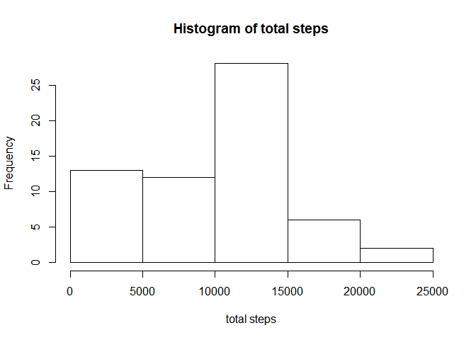

# Reproducible Research: Peer Assessment 1


## Loading and preprocessing the data


```r
if (!file.exists("activity.zip")) {
  download.file("https://d396qusza40orc.cloudfront.net/repdata%2Fdata%2Factivity.zip", destfile = "activity.zip")
  unzip("activity.zip")
}
activity <- read.csv("activity.csv",header = TRUE)
```


## What is mean total number of steps taken per day?

Missing values in the dataset are ignored in the calculations in this section.

### Load libraries: dplyr and ggplot2

```r
library(dplyr)
library(ggplot2)
```

### Total steps per day and histogram

```r
day.total <- activity %>% group_by(date) %>% summarise(total.steps=sum(steps,na.rm=TRUE))
hist(day.total$total.steps, main="Histogram of total steps", xlab="total steps")
```

<!-- -->

### Mean and median

```r
mean(day.total$total.steps,na.rm=TRUE)
```

```
## [1] 9354.23
```

```r
median(day.total$total.steps,na.rm=TRUE)
```

```
## [1] 10395
```


## What is the average daily activity pattern?


### Time series plot


```r
day.interval <- activity %>% group_by(interval) %>% summarise(avg.steps = mean(steps,na.rm=TRUE))
with(day.interval,plot(avg.steps, type = "l", main = "Average Number of Steps Taken",ylab="average steps"))
```

<!-- -->

### Interval that contains the maximum number of steps


```r
day.interval[day.interval$avg.steps==max(day.interval$avg.steps),"interval"]
```

```
## # A tibble: 1 x 1
##   interval
##      <int>
## 1      835
```

## Imputing missing values

```r
activity2 <- activity
na.interval <- unique(activity2[is.na(activity2$steps),"interval"])
for (i in 1:length(na.interval)){
  temp <- na.interval[i]
  activity2[is.na(activity2$steps) & activity2$interval==temp, "steps"] <- day.interval[day.interval==temp,"avg.steps"]
}
```
### Total steps per day and histogram

```r
day.total2 <- activity2 %>% group_by(date) %>% summarise(total.steps=sum(steps,na.rm=TRUE))
hist(day.total2$total.steps, main="Histogram of Total Steps Taken", xlab="total steps")
```

<!-- -->

### Mean and Median

```r
mean(day.total2$total.steps,na.rm=TRUE)
```

```
## [1] 10765.99
```

```r
median(day.total2$total.steps,na.rm=TRUE)
```

```
## [1] 10764.47
```


## Are there differences in activity patterns between weekdays and weekends?
### New factor variable for weekday and weekend


```r
activity2 <- activity2 %>% mutate(day= ifelse(as.character(weekdays(as.Date(date))) %in% c("Saturday", "Sunday"), 'weekend', 'weekday'))
```
### Panel time series plot of average steps on weekdays and weekend


```r
avg.steps <-  activity2 %>% group_by(interval,day) %>% summarise(avg.steps=mean(steps))
ggplot(avg.steps, aes(1:length(avg.steps),avg.steps))+geom_line()+ facet_wrap(~day) + labs(title="Average Steps, Weekdays and Weekend", x="", y="average steps")
```

<!-- -->


